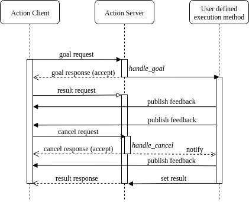
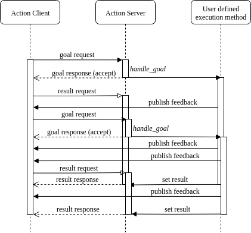

#  Action Module

## Background
There are **three forms of communication** in ROS: topics, services, and actions. 

Topic publishers broadcast to multiple subscribers, but communication is one-way. 

There are two entities involved in services and actions: an action server and an action client.

Service clients send a request to a service server and get a response, but there is no information about the progress. 

Similar to services, action clients send a request to an action server in order to achieve some goal and will get a result. 
Unlike services, while the action is being peformed an action server sends progress feedback to the client.

Actions are useful when a response may take a significant length of time. 
They allow a client to track the progress of a request, get the final outcome, and optionally cancel the request before it completes.

**Under the hood, an action is made up of three services and two topics.**

## Action Interface Definition
Actions are specified using a form of the ROS Message IDL. The specification contains three sections, each of which is a message specification:

* Goal

This describes what the action should achieve and how it should do it. It is sent to the action server when it is requested to execute an action.

* Result

This describes the outcome of an action. It is sent from the server to the client when the action execution ends, whether successfully or not.

* Feedback

This describes the progress towards completing an action. It is sent to the client of the action from the action server between commencing action execution and prior to the action completing. This data is used by the client to understand the progress of executing the action.

Any of these sections may be empty. Between each of the three sections is a line containing three hyphens, ---. Action specifications are stored in a file ending in .action. There is one action specification per .action file.


## Example
```
# Define a goal of washing all dishes
bool heavy_duty  # Spend extra time cleaning
---
# Define the result that will be published after the action execution ends.
uint32 total_dishes_cleaned
---
# Define a feedback message that will be published during action execution.
float32 percent_complete
uint32 number_dishes_cleaned
```

## Client/Server Interaction Examples
Here are a couple of sequence diagrams depicting typical interactions between an action client and action server.

### Example 1
In this example, the action client requests a goal and gets a response from the server accepting the goal (synchronous). 

Upon accepting the goal, the action server starts a user defined execution method for completing the goal. 

Following the goal request, the client makes an asynchronous request for the result. 

The user defined method publishes feedback to the action client as it executes the goal. 

Ultimately, the user defined method populates a result message that is used as part of the result response.


### Example 2
This example is almost identical to the first, but this time the action client requests for the goal to be canceled mid-execution. 

Note that the user defined method is allowed to perform any shutdown operations after the cancel request before returning with the cancellation result.



### Example 3
Here is a more complex example involving multiple goals.


